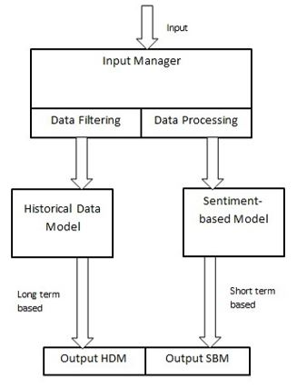

<!DOCTYPE html>
<html>
<head>
  <title>Stock Price Recommender</title>
</head>
<body>

<h1>Stock Price Recommender</h1>

<h3>
  A web application that analyzes real-time data such as news and Twitter activity for a given stock, 
  along with its historical performance, to produce a consolidated prediction with high accuracy.
</h3>

  

<h2>📌 System Architecture</h2>

<h3>I. Input Manager</h3>

  Responsible for preparing correct and compatible input features for the machine learning models. 
  It consists of two sub-modules:

<ol>
  <li><b>Data Filter Unit</b>
    <ul>
      <li>Filters out unnecessary attributes from the dataset.</li>
      <li>Keeps only the required features for further preprocessing.</li>
    </ul>
  </li>
  <li><b>Data Processing Unit</b>
    <ul>
      <li>Handles data cleaning and normalization.</li>
      <li>Reshapes datasets into model-compatible formats.</li>
      <li>Converts tweets and news text into sentiment values (for sentiment-based models).</li>
    </ul>
  </li>
</ol>

<h3>II. Historical Data Model</h3>
<ul>
  <li>Uses <b>LSTM networks</b>.</li>
  <li>Input shape: <code>(1, 60, 1)</code> → last <b>60 days of closing prices</b>.</li>
  <li>Output: Predicts the <b>next day’s stock closing price</b> purely from historical patterns.</li>
</ul>

<h3>III. Sentiment-Based Model</h3>
<ul>
  <li>Uses <b>LSTM networks</b>.</li>
  <li>Input shape: <code>(1, 3, 2)</code> → past <b>3 days of closing prices + sentiment values</b>.</li>
  <li>Sentiment values are generated using <b>VADER Sentiment Analyzer</b> applied to:
    <ul>
      <li>Tweets</li>
      <li>News feeds</li>
    </ul>
  </li>
  <li>Output: Predicts the <b>next day’s closing price</b> with public sentiment impact included.</li>
</ul>

<h3>IV. Output</h3>
<ul>
  <li>The system produces two predictions:
    <ol>
      <li><b>Historical Model Prediction</b> – based on stock price history.</li>
      <li><b>Sentiment-Based Model Prediction</b> – incorporates market sentiment shifts.</li>
    </ol>
  </li>
  <li>A final <b>consolidated recommendation</b> is derived from both predictions.</li>
</ul>

<h2>⚙️ Installation Guide</h2>

<ol>
  <li><b>Create a virtual environment (Python 3.8.10 recommended):</b>
    <pre><code>virtualenv -p &lt;interpreter-path&gt; &lt;env_name&gt;</code></pre>
  </li>

  <li><b>Activate the environment:</b>
    <pre><code>source &lt;env_name&gt;/bin/activate</code></pre>
  </li>

  <li><b>Install dependencies from requirements.txt:</b>
    <pre><code>pip install -r requirements.txt</code></pre>
  </li>

  <li><b>Install any missing modules manually (if required):</b>
    <pre><code>pip install &lt;module&gt;</code></pre>
  </li>

  <li><b>Add your NewsAPI key:</b>
    <ul>
      <li>Open <code>app.py</code></li>
      <li>Replace the placeholder API key with your own (get one at <a href="https://newsapi.org" target="_blank">https://newsapi.org</a>)</li>
    </ul>
  </li>

  <li><b>Run the Streamlit server:</b>
    <pre><code>streamlit run app.py</code></pre>
  </li>
</ol>

<h2>📂 Project Structure (after installation)</h2>

  

<h2>📊 Dashboard Preview</h2>

  <a href="Repository_extra/project_dashboard.pdf" target="_blank">Click here for Dashboard Preview (PDF)</a> 
  <i>(Download if preview does not render properly)</i>

</body>
</html>
